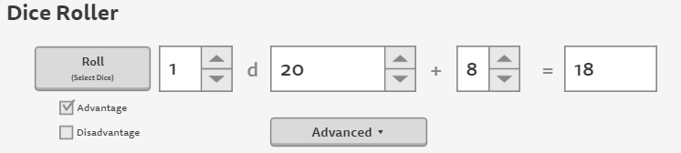
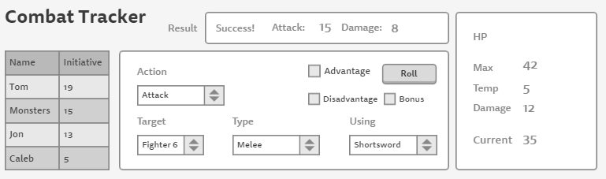
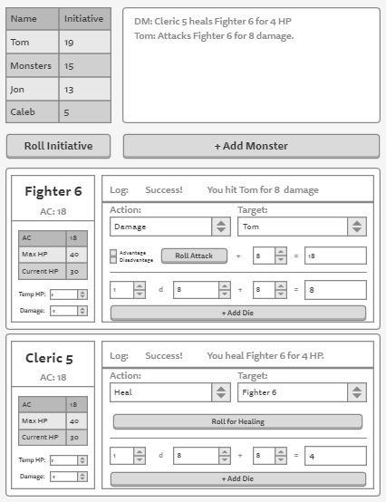
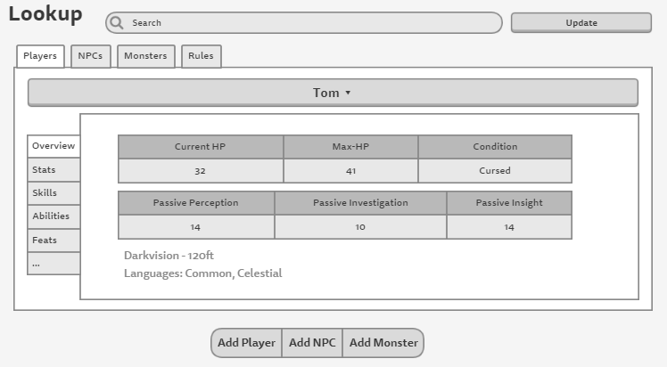
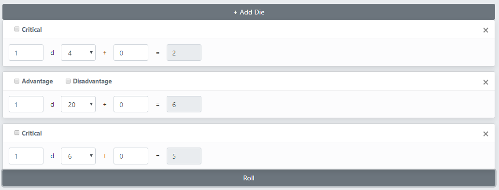

# Project Introduction
This repository contains Matthew Greenlaw and Theron Anderson's final project for CS 465: Full-Stack Web Development at Portland State University. The project is a combat tracker for [D&D 5th edition](https://en.wikipedia.org/wiki/Editions_of_Dungeons_%26_Dragons#Dungeons_&_Dragons_5th_edition) using [React](https://reactjs.org/), and the [Random.org JSON-RPC API](https://api.random.org/json-rpc/2). 

## Design Considerations
The project is [released](https://github.com/MatthewGreenlaw/5eCombatTracker/releases) in successive [stages](#stages-of-development) by major components:
1. DiceRoller  

Provides an interface for users to roll dice. Users can select any number of any kind of die and attach a modifier to the roll. Users can make attack and ability check rolls with advantage (roll twice, take highest, add modifier) and/or disadvantage (roll twice, take lowest, add modifier) and can make damage rolls with or without critical damage (roll twice, add both, add modifier). Users can add as many sets of dice as they wish to roll at one time and remove sets of dice until there is only one set to roll.  

2. Player Combat Tracker  

3. DM Combat Tracker  

4. Lookup Tool  

### Todo

# Stages of Development
1. [ ] [Stage 1](https://github.com/MatthewGreenlaw/5eCombatTracker/releases/tag/Stage-1): Dice Roller
   1. [ ] Dice component
      * [x] Implementation
      * [ ] Unit Tests
   2. [ ] DiceRoller component
      * [x] Implementation
      * [ ] Unit Test
   3. [ ] Integration Tests

2. [x] [Stage 2](https://github.com/MatthewGreenlaw/5eCombatTracker/releases/tag/Stage-2): Player Combat Tracker

3. [ ] [Stage 3](https://github.com/MatthewGreenlaw/5eCombatTracker/releases/tag/Stage-3): DM Combat Tracker

4. [ ] [Stage 4](https://github.com/MatthewGreenlaw/5eCombatTracker/releases/tag/Stage-4): Lookup Tool

# Installation Instructions

Todo