# Project Introduction
This repository contains Matthew Greenlaw and Theron Anderson's final project for CS 465: Full-Stack Web Development at Portland State University. The project is a combat tracker for [D&D 5th edition](https://en.wikipedia.org/wiki/Editions_of_Dungeons_%26_Dragons#Dungeons_&_Dragons_5th_edition) using [React](https://reactjs.org/), and the [Random.org JSON-RPC API](https://api.random.org/json-rpc/2).

## Design Considerations
The project is [released](https://github.com/MatthewGreenlaw/5eCombatTracker/releases) in successive [stages](#stages-of-development) by major components:
1. DiceRoller  

The DiceRoller component provides an interface for users to roll dice. Users can select any number of any kind of die and attach a modifier to the roll. Users can make attack and ability check rolls with advantage (roll twice, take highest, add modifier) and/or disadvantage (roll twice, take lowest, add modifier) and can make damage rolls with or without critical damage (roll twice, add both, add modifier). Users can add as many sets of dice as they wish to roll at one time and remove sets of dice until there is only one set to roll.  


2. Player Combat Tracker  

The PlayerCombatTracker component keeps track of the actions made by a player. It is a wrapper for an InitiativeTracker component and an Entity Component and initializes its Entity component by passing it a JSON object containing the player's stats. Upon creation, the PlayerCombatTracker emits an event to the server for the DMCombatTracker to add the player's information. It also emits events when a player rolls damage/health/initiative, or updates its temp HP or damage. Likewise, the PlayerCombatTracker listens for damage given/taken to/from it and for initiative updates.  

  

3. DM Combat Tracker  
The DMCombatTracker component keeps track of the actions made by all players and monsters. It is a wrapper for an InitiativeTracker component and a list of Entity Components representing monsters. It initializes monster Entity component by passing them a JSON object containing the monster's stats. Upon creation, the PlayerCombatTracker emits an event to the server for the PlayerCombatTracker to add the monster's initiative to all player InitaitiveTrackers. It also emits events to player when a monster rolls damage against that player. Likewise, the DMCombatTracker listens for damage given to monsters and for player initiative updates.  

  

4. Lookup Tool  
  

# Stages of Development
1. [X] [Stage 1](https://github.com/MatthewGreenlaw/5eCombatTracker/releases/tag/Stage-1): Dice Roller
  <table>
    <tr>
      <td>1</td>
      <td>[X] random.org API</td>
      <td></td>
    </tr>
    <tr>
      <td>2</td>
      <td>[X] Dice</td>
      <td>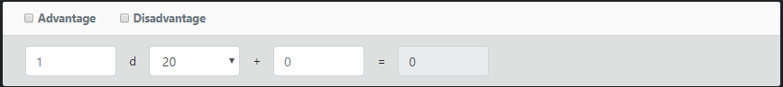</td>
    </tr>
    <tr>
      <td>3</td>
      <td>[X] Dice Roller</td>
      <td>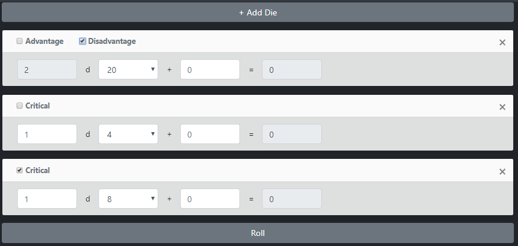</td>
    </tr>
  </table>

2. [X] [Stage 2](https://github.com/MatthewGreenlaw/5eCombatTracker/releases/tag/Stage-2): Player and DM Combat Tracker
<table>
  <tr>
    <td>1</td>
    <td>[X] Add player Form</td>
    <td></td>
  </tr>
  <tr>
    <td>2</td>
    <td>[X] Initiative Tracker</td>
    <td>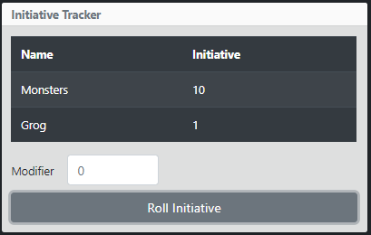</td>
  </tr>
  <tr>
    <td>3</td>
    <td>[X] Action Tracker</td>
    <td>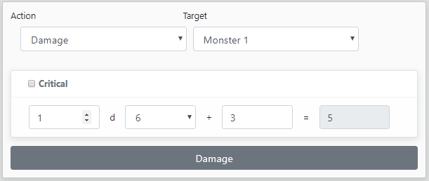</td>
  </tr>
  <tr>
    <td>3</td>
    <td>[X] Attack Roller</td>
    <td>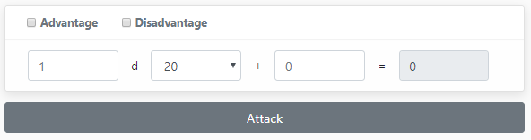</td>
  </tr>
  <tr>
    <td>4</td>
    <td>[X] Health Tracker</td>
    <td>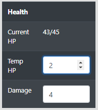</td>
  </tr>
  <tr>
    <td>5</td>
    <td>[X] Log</td>
    <td>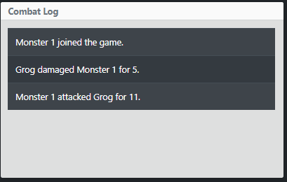</td>
  </tr>
  <tr>
    <td>6</td>
    <td>[X] Entity</td>
    <td>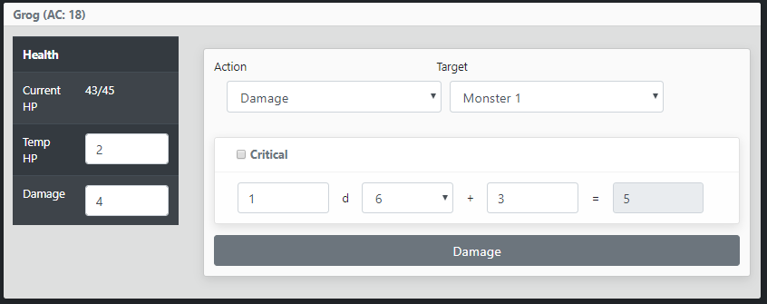</td>
  </tr>
  <tr>
    <td>7</td>
    <td>[X] Player</td>
    <td>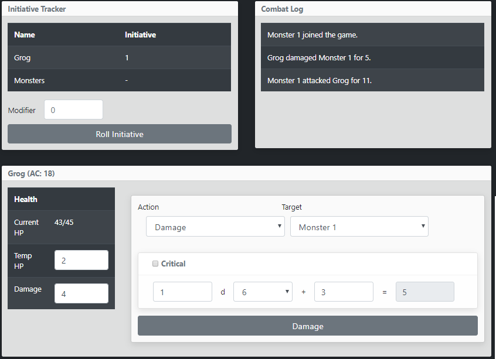</td>
  </tr>
  <tr>
    <td>8</td>
    <td>[X] New Monster Form</td>
    <td>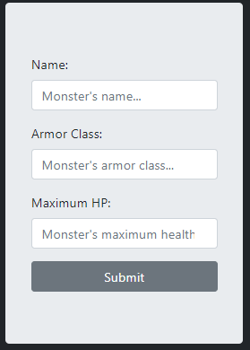</td>
  </tr>
  <tr>
    <td>9</td>
    <td>[X] Dungeon Master</td>
    <td>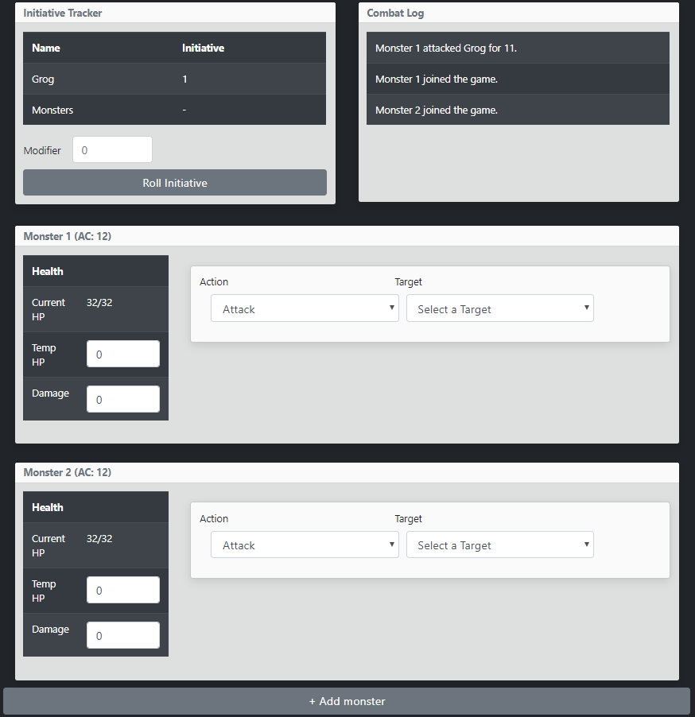</td>
  </tr>
  <tr>
    <td>10</td>
    <td>[X] Landing page and Routing</td>
    <td>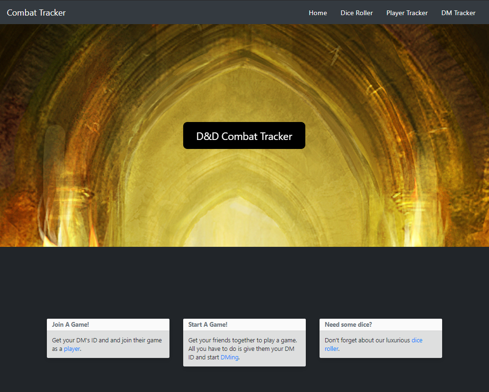</td>
  </tr>
</table>


3. [ ] [Stage 3](https://github.com/MatthewGreenlaw/5eCombatTracker/releases/tag/Stage-3): Advanced Attack Roller
  1. [X] Add player Form
  2. [X] Initiative Tracker
  3. [X] Action Tracker
  4. [X] Attack Roller
  4. [X] Health Tracker
  5. [X] Log

4. [ ] [Stage 4](https://github.com/MatthewGreenlaw/5eCombatTracker/releases/tag/Stage-4): Chat


5. [ ] [Stage 5](https://github.com/MatthewGreenlaw/5eCombatTracker/releases/tag/Stage-5): Lookup Tool  

## Known Issues
1. DungeonMaster  
  * Adding new monsters resets all masters to their initial state. Need to maintain changes to an existing monster's state when adding new monsters.  

2. AttackRoller  
  * When switch between actions, shown values do not represent actual values. Values have to be manually reset to take any effect.


# Installation Instructions

## Requirments

Node.js and NPM

## Setup
In the root directory of the project:
* Install dependencies by running ```yarn install```.
* Start the development server by running ```yarn start```.
* Create a production build by running ```yarn build```.
* Run tests by running ```yarn test```.
* Run tests with code coverage by running ```yarn test:coverage```.
