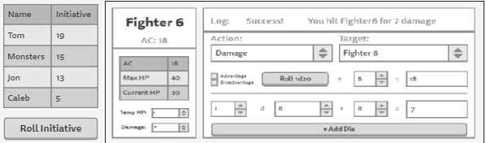

# Project Introduction
This repository contains Matthew Greenlaw and Theron Anderson's final project for CS 465: Full-Stack Web Development at Portland State University. The project is a combat tracker for [D&D 5th edition](https://en.wikipedia.org/wiki/Editions_of_Dungeons_%26_Dragons#Dungeons_&_Dragons_5th_edition) using [React](https://reactjs.org/), the [Random.org JSON-RPC API](https://api.random.org/json-rpc/2), and [Socket.io](https://socket.io/). [The project website](http://5ecombattracker.matthewgreenlaw.com/) is [deployed](https://github.com/MatthewGreenlaw/5eCombatTracker/deployments) via GitHub pages.

## Design Considerations

### What We Planned To Happen
The project was to be [released](https://github.com/MatthewGreenlaw/5eCombatTracker/releases) in successive [stages](#stages-of-development) by major components:
1. DiceRoller  

The DiceRoller component provides an interface for users to roll dice. Users can select any number of any kind of die and attach a modifier to the roll. Users can make attack and ability check rolls with advantage (roll twice, take highest, add modifier) and/or disadvantage (roll twice, take lowest, add modifier) and can make damage rolls with or without critical damage (roll twice, add both, add modifier). Users can add as many sets of dice as they wish to roll at one time and remove sets of dice until there is only one set to roll.  


2. Player Combat Tracker  

The PlayerCombatTracker component keeps track of the actions made by a player. It is a wrapper for an InitiativeTracker component and an Entity Component and initializes its Entity component by passing it a JSON object containing the player's stats. Upon creation, the PlayerCombatTracker emits an event to the server for the DMCombatTracker to add the player's information. It also emits events when a player rolls damage/health/initiative, or updates its temp HP or damage. Likewise, the PlayerCombatTracker listens for damage given/taken to/from it and for initiative updates.  

  

3. DM Combat Tracker  
The DMCombatTracker component keeps track of the actions made by all players and monsters. It is a wrapper for an InitiativeTracker component and a list of Entity Components representing monsters. It initializes monster Entity component by passing them a JSON object containing the monster's stats. Upon creation, the PlayerCombatTracker emits an event to the server for the PlayerCombatTracker to add the monster's initiative to all player InitaitiveTrackers. It also emits events to player when a monster rolls damage against that player. Likewise, the DMCombatTracker listens for damage given to monsters and for player initiative updates.  

  

4. Lookup Tool  


### What Actually Happened / Issues we encountered

* Stage completion: We followed the plan through Stage-1, but then became overwhelmed with other classwork and the complexity of the project. It became clear that we needed to implement both the Player and DM trackers at the same time so that we could make sure they interacted properly. This resulted in us reducing our planned Stage-2 and Stage-3 into just Stage-2. This process included minor component and placement changes.

* Building players: We originally thought we could build players from [D&D Beyond](https://dndbeyond.com) due to the ability to get the JSON representation of the character by adding ```/JSON``` to the character URL. Unfortunately, this is only allowed by their site when you are logged on and we could not figure out a way to log on to the site in a fetch request. We found a way to get a [public URL](https://www.dndbeyond.com/characters/4160255/) of a character that we can use without logging on, but it does not allow us to add the ```/JSON``` path to get the JSON representation of the character. We overcame this by creating a form to create new players. This is still an issue I want to resolve, so if you know a way to do it please contact me.  

* Building monsters: Duplicate of building players, but instead being able to read in characters from D&D Beyond as monsters.

* Combat: Since we originally planned to read in player and monster information, we thought we could build the combat functionality (rolling attacks / damage / etc..) from what weapons, armor, etc.. players had available to them. Since we had to generate data, and that data was considerably limited to limit the time needed for a user to create a player / monster, we also felt limited in what we could do with combat. Ideally, a player would attack a monster and the damage would go through if the attack succeeded or fail to go through if the attack failed. Currently, Players can attack, but deciding if that attack hit is up to the player. Then if they want to do damage they have to switch their action to do damage. The damage is automatically calculated on the receiving end, so at least there is that.

# Stages of Development
1. [X] [Stage 1](https://github.com/MatthewGreenlaw/5eCombatTracker/releases/tag/Stage-1): Dice Roller
  1. [X] random.org API
  2. [X] Dice
  3. [X] Dice Roller

2. [X] [Stage 2](https://github.com/MatthewGreenlaw/5eCombatTracker/releases/tag/Stage-2): Player and DM Combat Tracker
  1. [X] Add Player Form
  2. [X] Initiative Tracker
  3. [X] Action Tracker
  4. [X] Attack Roller
  5. [X] Health Tracker
  6. [X] Log
  7. [X] Player
  8. [X] New Monster Form
  9. [X] Dungeon Master Tracker
  10. [X] Landing Page

3. [ ] [Stage 3](https://github.com/MatthewGreenlaw/5eCombatTracker/releases/tag/Stage-3): Bug Fixes and Advanced Attack Roller
  1. [ ] Maintenance:
    * [ ] Ability to remove monsters in DungeonMaster
    * [ ] Fix adding new monster bug in DungeonMaster
  3. [ ] Allow users to add multiple damage dice
  4. [ ] Allow users to attack and do damage on success in one click

4. [ ] [Stage 4](https://github.com/MatthewGreenlaw/5eCombatTracker/releases/tag/Stage-4): Chat
  1. [ ] Add chat feature to Log component

5. [ ] [Stage 5](https://github.com/MatthewGreenlaw/5eCombatTracker/releases/tag/Stage-5): Lookup Tool
  1. [ ] LookupTool component


## Known Bugs / Issues
* Navigation (issue): Due to being hosted on GitHub pages, accessing the site with anything other than the root path results in a 404 error. This means you can navigate from within the site but cannot access ```/somePath``` or refresh pages. This limitation is only present on GitHub pages and is not an issue if served from any other web server. For that reason, this issue will not be resolved.

* DungeonMaster (issue): Users cannot remove monsters after creating them. To resolve this issue, we likely need to wrap monsters in another abstraction component to better manage them (like Dice are managed by the DiceRoller component).

* DungeonMaster (bug): Adding new monsters resets all masters to their initial state. Need to maintain changes to an existing monster's state when adding new monsters. This bug can be resolved by tracking monster state in the DungeonMaster component and sending a callback to monster Entity components for updates. Due to the complexity of this bug, it will not be resolved quickly and therefore will not make it into the Stage-2 release. This bug will be fixed in Stage-3.

* AttackRoller (bug): When switching between actions, shown values do not represent actual values. Values have to be manually reset to take any effect. This issue is due to the AttackRoller component only keeping track of one set of dice for each type of action (Attack / Damage / Heal). This bug can be resolved by keeping track of sets of dice for each action type and using logic to swap active dice sets when the action changes. Due to the complexity of this bug, it will not be resolved quickly and therefore will not make it into the Stage-2 release. This bug will be fixed in Stage-3.

# Installation Instructions

## Requirments

Node.js and NPM

## Setup
In the root directory of the project:
* Install dependencies by running ```yarn install```.
* Start the development server by running ```yarn start```.
* Create a production build by running ```yarn build```.

# Screenshots
<table>
  <tr>
    <td>random.org API</td>
    <td></td>
  </tr>
  <tr>
    <td>Dice</td>
    <td></td>
  </tr>
  <tr>
    <td>Dice Roller</td>
    <td></td>
  </tr>
  <tr>
    <td>Add player Form</td>
    <td></td>
  </tr>
  <tr>
    <td>Initiative Tracker</td>
    <td></td>
  </tr>
  <tr>
    <td>Action Tracker</td>
    <td></td>
  </tr>
  <tr>
    <td>Attack Roller</td>
    <td></td>
  </tr>
  <tr>
    <td>Health Tracker</td>
    <td></td>
  </tr>
  <tr>
    <td>Log</td>
    <td></td>
  </tr>
  <tr>
    <td>Entity</td>
    <td></td>
  </tr>
  <tr>
    <td>Player</td>
    <td></td>
  </tr>
  <tr>
    <td>New Monster Form</td>
    <td></td>
  </tr>
  <tr>
    <td>Dungeon Master</td>
    <td></td>
  </tr>
  <tr>
    <td>Landing page and Routing</td>
    <td></td>
  </tr>
</table>
